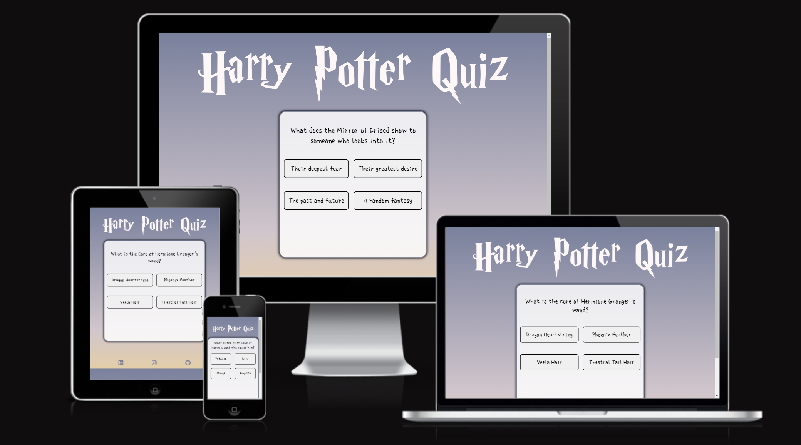

## Harry Potter Quiz-app

### Welcome to the Harry Potter Quiz App. Test your magical knowledge with a collection of enchanting questions from the world of Harry Potter.

### The purpose of this project is to provide an engaging and fun way for Harry Potter fans to challenge their knowledge of the series by answering some random questions in a quiz app.

[This is the link](https://markohautala.github.io/portfolio-project-2/) to the deployed live website for this project.

[This is the link](https://github.com/markohautala/portfolio-project-2) to the GitHub repository for this project.

## Coding languages that I have used

Accoring to my GitHub, these are the coding-languages that are used in the project:

- JavaScript: 43.9%

- CSS: 16.6%

- HTML: 16.0%

- Dockerfile: 12.5%

- Python: 5.8%

- Shell: 5.2%

## Features

- The logo: This project features a Harry Potter-themed logo at the page's header, complete with a font reminiscent of the iconic style used in the movies, and it displays the text 'Harry Potter Quiz.' Its aim is to immerse the user in an authentic Harry Potter experience.

- Color gradient background: The entire page is adorned with a continuous gradient background, smoothly transitioning between different colors from top to bottom. This design choice is intended to provide the user with a visually pleasing and enjoyable experience while doing the quiz.

- Quiz-module: The centerpiece of this application is the quiz module. It commences with a 'start quiz' button, followed by a sequence of 15 unique questions derived from the Harry Potter series. Each question presents four answer choices, and upon selection, it visually indicates correctness with either a green or red color. Subsequently, a 'next question' button appears after each question response, guiding the user to the subsequent question. Upon reaching the final question, this button transforms into a 'restart quiz' option, allowing users to begin the quiz anew.

- Footer: At the bottom of the page, underneath the quiz-module, there is a footer-section with 3 icons - Instagram, GitHub and a LinkedIn icon with internal links that open in a new tab. These links takes the user to the creater of the quiz-app (me, the developer).

## What tools/resources I have used
- Font awesome for all the icons in the footer
- The color-gradient CSS-code was created by using [this webpage](https://cssgradient.io/).
- Google fonts are used to display the choise of fonts in the webpages textareas.
- DevTools has been used all the time during the development process to preview the code-changes.
- To generate the Logo/hero image of "harry Potter Quiz" i used [this webpage](https://www.fontspace.com/).
- To get the different favicons right i used [this website](https://favicon.io/).

## Browsers and testing

The website has been tested and seamlessly operates across various browsers, free from any compatibility issues. It ensures a smooth and consistent user experience for all visitors.

## Responsive design

I utilized [this website](https://ui.dev/amiresponsive) to obtain the image shown above, demonstrating the website's responsiveness as it adapts its content to various screen sizes, including smartphones, tablets, and desktop viewports.

Continous testing and inspection with dev-tools and the usage of media queries have made the website responsive regarding it's desing.

## Things to add in the futute to the webpage
- A counter in the quiz-module that counts how many "correct answers" a user gets during the quiz - like a score and then return this value to the user so that it displys on the screen or quiz-module itself.
- More questions - but for now it could be considered enough with the existing 15 questions that are built in the quiz-module for the purpose of this project.

## Bug Details

Here are the details of the resolved bugs:

Describe the bug and the steps to reproduce it.
Explain how the bug was resolved, including any code changes or fixes.
Discuss the impact of this bug on users and the importance of the fix.

#### Bug 1
- When I enlarged the quiz-section and the Harry Potter logo, it all pushed the content on top of the footer. This was not desired and I first tried to apply "padding-top: 60px;" in the footer to give it some space. This did not solve the issue since it created space for the footer, but it was not transparent like it sohuld be. But then I added "margin-top: 60px;" instead and this fixed the issue.

#### Bug 2
- Another problem was a UX/design problem and that was when I added the background colors for the buttons to green and red, it was disturbing to have a hover background color to white since it removed the red/green color. This resulted in the fact that if you answered correctly, the button did not turn green if you had your mouse/pointer on it. I removed the hover effect and I settled with a border-color instead on the hover.

#### Bug 3
- When I deployed my project early, it all looked like it should on my desktop but on my iphone IOS the text in the buttons were blue but on the desktop version they were black. Apperently, IOS sets button colors to a initial blue color. Also buttons on IOS dont have border-color but on my chrome and windows they did. This was fixed by first adding a border-color of black with 2px thickness and finally I had to specify the color inside of the buttons to black, so that it would "overwrite" the default styling from the IOS-units. This fixed the issue.

#### Bug 4
- When I made my website responsive using media queries I noticed that the "footer crashed with the main-element". They overlapped but they are suppose to be own sections on their own places. I tried to change "height: 100vh;" to "height: 100%;" instead and this solved all the issues instantly.

## Lighthouse testing and result

- Performance: 96%

- Accessibility: 100%

- Best Practices: 100%

- SEO: 100%

## Validator testing

- CSS: No warnings or problems to show - CSS code validated using W3C CSS Validator.

- HTML: The HTML code passed the W3 validator with no warnings - "Document checking completed. No errors or warnings to show."

- JavaScript: The JavaScript code for this project passed and got validated using the JSHint with no warnings or errors.

## Deployment procedure

This site is deployed using GitHub pages.
To deploy the page using GitHub pages:
- Login or signup to GitHub.
- Go to the repository for this project: [link](https://github.com/markohautala/portfolio-project-2).
- Click the settings button.
- Select pages in the left hand navigation menu.
- From the source dropdown, select main branch and click save.
- The site has now been deployed - it might take a few minutes for it to load.

## Credits

- I have got inspiration from "Web Dev Simplified" from YouTube - they had a video on how to structure a quiz app and it has been really helpful in the process of building my own in this project.

